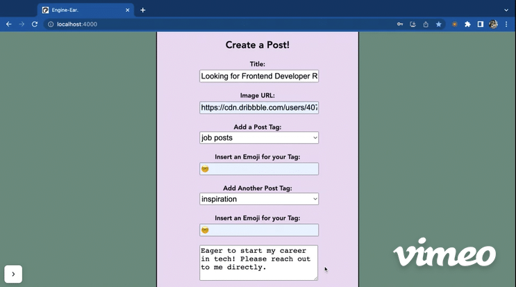
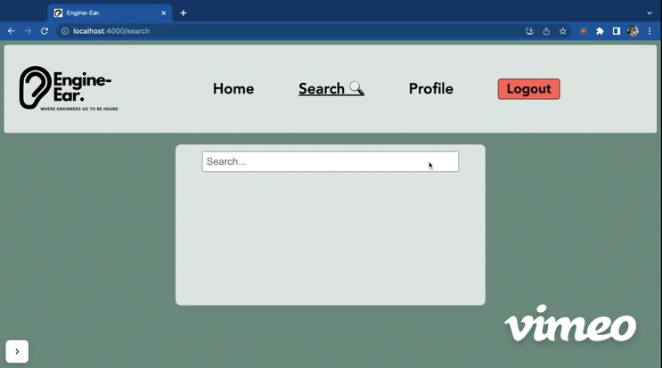

# Engine-Ear.

Welcome to Engine-Ear. - The 'LinkedIn' for software engineers!

This React & Rails single-page application was created by [Henry Wu](https://github.com/hhw67865), [Leah Cardoz](https://github.com/lcardoz) & [Justin Woodruff](https://github.com/di4bolik4l) for their Phase 4 software engineering group project at Flatiron School (1 week to build).

## Features:

Without logging in, users should be able to:
- See posts created by other users and filter posts by tags.
- See other users (but not their profiles).
- Sign up by creating a user account.
- Search for users.

Logged in users should be able to:
- Update their profile.
- Delete their account.
- Create posts.
- Comment on posts and delete their comments.
- View other users' profiles.
- Filter posts to only show followed users' posts.
- Follow and unfollow other users.

## Demos:

[Watch Leah demo the entire app here!](https://vimeo.com/799307351)

**Landing Page**


**User Login / User Profile**


**Edit Profile**


**Create Post**



**Add Comment / Delete Comment on Post**


**User Search / Load Different User Profile / Follow a User**




## Tech Stack & Requirements:

Backend Ruby/Rails:
- ruby 2.7.4
- rails 7.0.4
- SQLite
- bcrypt
- active_model_serializers

Frontend React/create-react-app:
- react 18.2.0
- react-router-dom 6.6.1

## Getting Started:

1. Install dependencies:

```sh
npm install
```

2. Start Rails server:

```sh
rails s
```

3. Start React client server:

```sh
cd client
```
```sh
npm start
```